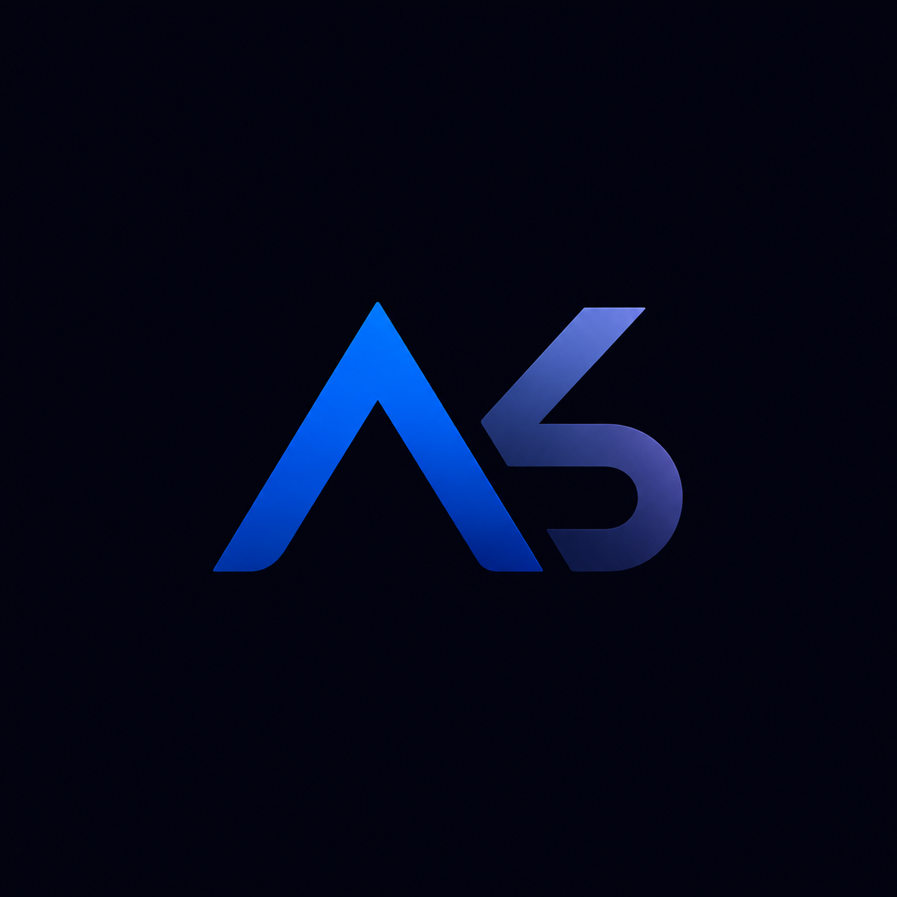

<div align="center">
  

  <h1>AKS — AI Workspace Landing Page</h1>

  <p>
    A premium, responsive SaaS landing page for an intelligent workspace that
    helps modern teams organize projects, automate workflows, and make clearer decisions.
  </p>

  <p>
    <a href="https://aks-landing-page.vercel.app/"><strong>🚀 View Live Demo</strong></a>
  </p>

  <p>
    
    
    
    
  </p>
</div>

## ✨ About the project

AKS is a portfolio-focused one-page B2B SaaS experience. It presents a fictional AI workspace built to reduce scattered work, automate repetitive processes, summarize meetings, and provide useful operational insight.

The design combines a dark blue-black interface, clear typography, restrained blue and purple accents, lightweight product mockups, and responsive scroll-based motion.

## 🧩 Landing-page sections

- Responsive Navbar with an accessible mobile drawer and scroll-progress line.
- Animated Hero with product-inspired interface visuals.
- Trusted By marquee with 3D cards and a pointer-following blue spotlight.
- Sticky-scroll Services experience with four animated product scenes.
- Three-row Product Showcase with alternating responsive layouts.
- About AKS statement and product metrics.
- Customer testimonial cards.
- Three-tier Pricing section.
- Accessible animated FAQ accordion.
- Contact form connected to email.
- Responsive global Footer.

## 🎬 Motion and interaction

Motion is designed to support the content rather than distract from it:

- Hero content enters in a controlled sequence.
- Trusted-company cards move continuously with subtle 3D depth.
- Services use normal page scroll to drive a sticky four-stage experience.
- Product visuals enter from the top or side as they reach the viewport.
- Supporting sections use short fade-and-slide reveals.
- Pointer interactions use controlled blue highlights and small transforms.
- `prefers-reduced-motion` is respected throughout the experience.

## 🛠️ Technology

| Technology                                                               | Purpose                                                      |
| ------------------------------------------------------------------------ | ------------------------------------------------------------ |
| [Next.js 16](https://nextjs.org/)                                        | App Router, static rendering, metadata, and optimized assets |
| [React 19](https://react.dev/)                                           | Component-based user interface                               |
| [Tailwind CSS v4](https://tailwindcss.com/)                              | Semantic theme tokens and responsive styling                 |
| [Motion](https://motion.dev/)                                            | Entrance, hover, marquee, and scroll-linked animation        |
| [Lucide React](https://lucide.dev/)                                      | Consistent interface icons                                   |
| [next/image](https://nextjs.org/docs/app/api-reference/components/image) | Optimized logo rendering                                     |
| [Vercel](https://vercel.com/)                                            | Production deployment                                        |

## 📁 Project structure

```text
AKS-saas-landing-page/
├── data/                         # Static content for every page section
│   ├── about.js
│   ├── contact.js
│   ├── faq.js
│   ├── footer.js
│   ├── hero.js
│   ├── navigation.js
│   ├── pricing.js
│   ├── services.js
│   ├── showcase.js
│   ├── testimonials.js
│   └── trusted-by.js
├── public/
│   ├── logo.png
│   └── vidoes/hero/              # Supplied hero video assets
├── src/
│   ├── app/
│   │   ├── globals.css           # Tailwind v4 theme and global styles
│   │   ├── layout.js             # Metadata, font, Navbar, and page shell
│   │   └── page.js               # Landing-page section composition
│   └── components/
│       ├── HeroSection/
│       ├── TrustedSection/
│       ├── about-section/
│       ├── contact-section/
│       ├── faq-section/
│       ├── footer-section/
│       ├── navigation/
│       ├── pricing-section/
│       ├── product-showcase/
│       ├── services-section/
│       ├── testimonials-section/
│       └── ui/                   # Shared links and brand components
├── AGENTS.md
├── PROJECT_BRIEF.md
└── package.json
```

Static content remains in the root `data/` directory, while each major section owns its layout and animation components. Client Components are limited to features that require Motion, state, or browser APIs.

## 🚀 Run locally

```bash
git clone git@github.com:anasskafafy5-source/AK_Landing-Page.git
cd AK_Landing-Page
npm install
npm run dev
```

Open [http://localhost:3000](http://localhost:3000) in your browser.

## ✅ Project checks

```bash
npm run lint
npm run build
```

## 🌐 Live demo

Explore the deployed landing page at **[aks-landing-page.vercel.app](https://aks-landing-page.vercel.app/)**.

---

<div align="center">
  Designed and developed as a modern frontend portfolio project.<br />
  <a href="mailto:anasskafafy5@gmail.com">📩 Contact the developer</a>
</div>
